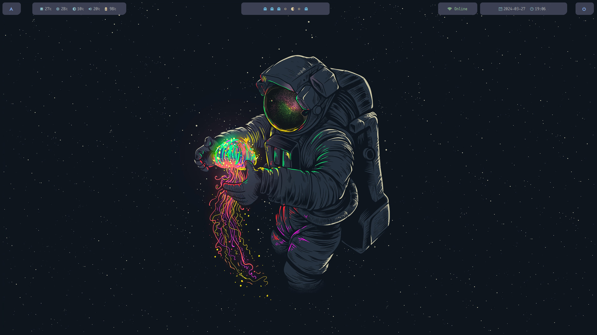

  
  
  # Michael - Arch Linux Customization

¡Bienvenido a mi galería de diseños personalizados para Arch Linux! A continuación, te presento una selección de capturas de pantalla de algunos de mis diseños favoritos y personalizados para mi sistema Arch Linux. Todos ellos utilizan las mismas herramientas de personalización:

- **Bspwm**: Gestor de ventanas personalizado para un control preciso y eficiente.
- **Picom**: Compositor de ventanas para efectos de transparencia y sombras suaves.
- **Cava**: Visualizador de espectro de audio que añade un toque de dinamismo al escritorio.
- **Alacritty**: Emulador de terminal rápido y personalizable para una experiencia de línea de comandos eficiente.
- **Nemo**: Administrador de archivos para una navegación intuitiva y funcional.
- **Polybar**: Barra de estado personalizada para mostrar información útil y accesos directos, utilizando las fuentes de Nerdfonts para los iconos.
- **Rofi**: Selector de aplicaciones y lanzador de programas altamente configurable.
- **sxhkd**: Utilizado para configurar los atajos de teclado.

## Tema 1: "Nebularch"

- **Descripción**: Este tema se inspira en la profundidad del espacio, con tonos oscuros y toques de neón que dan una sensación futurista.

¡Espero que encuentres inspiración en estos diseños y disfrutes personalizando tu propio sistema Arch Linux!
